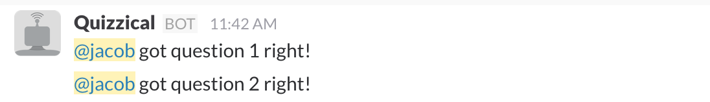

# Quizzical

A Slack Bot for administering quizzes.

## Installation

Install using the node package manager.

```bash
npm install -g quizzical
```

## Prerequisites

### [Slack Bot User](https://api.slack.com/bot-users)

In order to use Quizzical, you'll need to [create a Slack Bot User](https://api.slack.com/bot-users) and take note of its token.

### [Plot.ly Account and API key](https://plot.ly/)

Optionally, you can configure Quizzical with Plot.ly information so that Quizzical can create summary graphs for quiz responses. The free plan is sufficient to run Quizzical.

## Getting Started

Quizzical is a node application. Run it with:

```bash
quizzical [configuration options]
```

### Configuration

Configuration options can be passed via the command line or in a configuration file.

#### Command line

```bash
quizzical --slackToken abcd-123456 --botName "My Quizzical Bot" example_quiz.json
```

#### Configuration file

```json
{
    "slackToken": "abcd-123456",
    "botName": "My Quizzical Bot"
}
```

```bash
quizzical --config example_config.json example_quiz.json
```

#### Configuration options

Option | Required | Default | Description
------ | -------- | ------- | -----------
slackToken | x | n/a | Your slack bot user's API token
botName | | 'Quizzical' | The name of the bot when seen in Slack
plotlyAPIKey | | n/a | Your plot.ly API key, needed for graphing quiz results
plotlyUsername | | n/a | Your plot.ly username, needed for graphing quiz results
config | | n/a | Configuration file. Command line only.

#### Quiz files

You need to create quiz files for Quizzical in order to administer quizzes. You can add multiple quizzes by listing the files when running Quizzical.

```bash
quizzical --config example_config.json example_quiz.json quiz2.json quiz3.json
```

A quiz file looks like this:

```json
{
	"id": "example-quiz",
	"name": "Example Quiz",
	"questions": [
        {
            "q": "What shape is the earth?",
            "a": "a",
            "choices": {
                "a": "Round",
                "b": "Square",
                "c": "Triangular",
                "d": "Brown"
            }
        },
        {
            "q": "There are ___ continents on earth",
            "a": "7"
        }
    ]
}
```

Every quiz needs an *id*, *name* and a list of *questions*. Every question object must have a *q* (question) and *a* answer and, optionally, a map of *choices* for multiple choice questions. If no list of choices is provided, the question is free response. _Note: free response questions should have simple one word or number answers because Quizzical is looking for exact answers._


## Usage

In order to start a quiz, a Slack user (the instructor), needs to `@` message the Quizzical bot in a public channel.


Once the quiz is started, other Slack users (students) respond to it the Quizzical bot via direct message.


After everyone has had a chance to answer the first question, the instructor issues the `next` command to start the quiz in ernest. From now on, the quiz will automatically advance to the next question when all students have answered.


Quizzical will report how students are doing in real time to the instructor.



Finally, when the last question has been asked and answered, Quizzical will end the quiz, report the aggregate results in the public channel.


 Quizzical will also report individual results via direct message.


